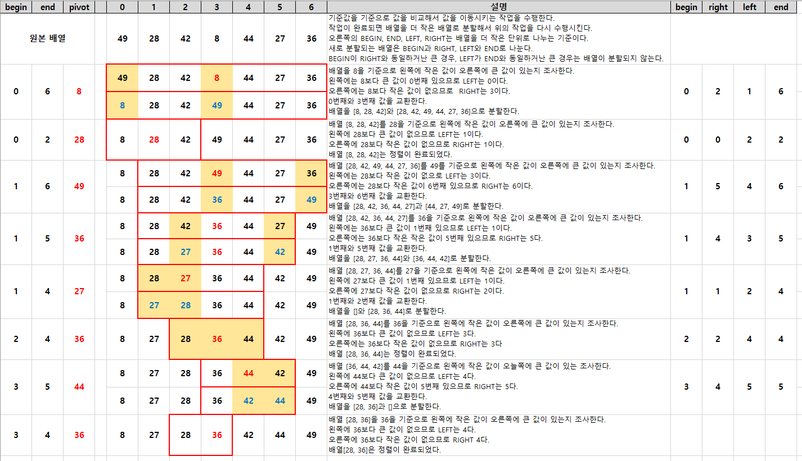

## Quick Sort

- 정렬할 전체 원소에 대해서 정렬을 수행하지 않고, 기준값을 중심으로 왼쪽 부분집합과 오른쪽 부분집합으로 분할하여 정렬하는 방식이다.

### 정렬 프로세스

1. 왼쪽 부분집합에는 기분 값보다 작은 원소들을 이동시키고, 오늘쪽 부분집합에는 기분 값보다 큰 원소들을 이동시킨다.
2. 기준 값 : 피봇(pivot), 일반적으로 전체 원소중에서 가운데에 위치한 원소를 선택한다.
3. 분할(divide) : 정렬할 자료들을 기준 값을 중심으로 2개의 부분집합으로 분할한다.
4. 정복(conquer) : 부분집합의 원소들 중에서 기준 값보다 작은 원소들은 왼쪽 부분집합으로, 기준 값보다 큰 원소들은 오른쪽 부분집합으로 정렬한다. 부분집합의 크기가 1이하로 충분히 작지 않으면 순환 호출을 이용하여 다시 분할한다.

### 정렬된 배열 예시

